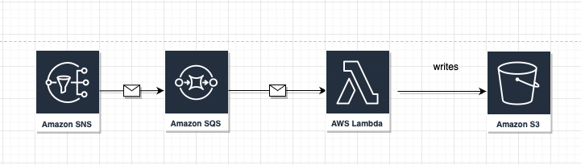

# Localstack with Docker:

## Introduction:
## Starting Localstack:
You can use localstack in many ways - install its binary script that starts a docker container, and set all the infrastructure needed, or using docker CLI, or docker-compose, [and other options](https://docs.localstack.cloud/get-started/)

In our Lab we will use docker-compose to lunch localstack, you can use the [docker-compose associated with tha lab](./docker/docker-compose.yaml).

## Scenario:
In This Lab, We will create an SNS that has an SQS subscribed to it, and a Lambda that starts listens on that SQS, and then process the message and upload it to an S3. the lab will use terraform to create all these resources on both environments - local - using localstack, and on AWS.



## Provisioning the necessary AWS Infrastructure:
In order to provision the AWS resources on localstack using terraform, we need first to override the AWS resources endpoints - as each AWS resource has a specific endpoint,
for example, EC2 endpoint is https://ec2.region-name-here.awsamazon.com, ...

for that, we will add this configuration to our terraform main.tf:
```terraform
provider "aws" {
  access_key                  = "foo"
  secret_key                  = "bar"
  region                      = "eu-central-1"
  skip_credentials_validation = true
  skip_metadata_api_check     = true
  skip_requesting_account_id  = true

  endpoints {
    apigateway     = "http://localhost:4566"
    apigatewayv2   = "http://localhost:4566"
    cloudformation = "http://localhost:4566"
    cloudwatch     = "http://localhost:4566"
    dynamodb       = "http://localhost:4566"
    ec2            = "http://localhost:4566"
    es             = "http://localhost:4566"
    elasticache    = "http://localhost:4566"
    firehose       = "http://localhost:4566"
    iam            = "http://localhost:4566"
    kinesis        = "http://localhost:4566"
    lambda         = "http://localhost:4566"
    rds            = "http://localhost:4566"
    redshift       = "http://localhost:4566"
    route53        = "http://localhost:4566"
    s3             = "http://s3.localhost.localstack.cloud:4566"
    secretsmanager = "http://localhost:4566"
    ses            = "http://localhost:4566"
    sns            = "http://localhost:4566"
    sqs            = "http://localhost:4566"
    ssm            = "http://localhost:4566"
    stepfunctions  = "http://localhost:4566"
    sts            = "http://localhost:4566"
  }
}
```

### Creating SNS:

##### Testing the SNS using AWS CLI:
```
# To avoid setting the endpoint-url everytime...
alias stck='aws --endpoint-url=http://localhost:4566'

# Publishing some messages to SNS
stck sns publish --topic-arn arn:aws:sns:eu-central-1:000000000000:localstack_sns.fifo --message-deduplication-id '2' --message-group 'localstack' --message 'two-message'
```

##### Testing SQS Subscription to SNS:
```
# first we can list all queues, to copy the queue-url of our SQS
stck sqs list-queues

# now, we can receive the message previously published to the SNS
stck sqs receive-message --queue-url queue-url-from-previous-command
```

